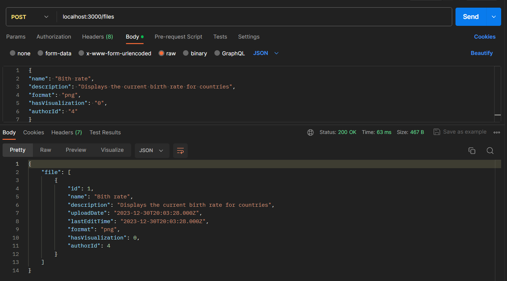
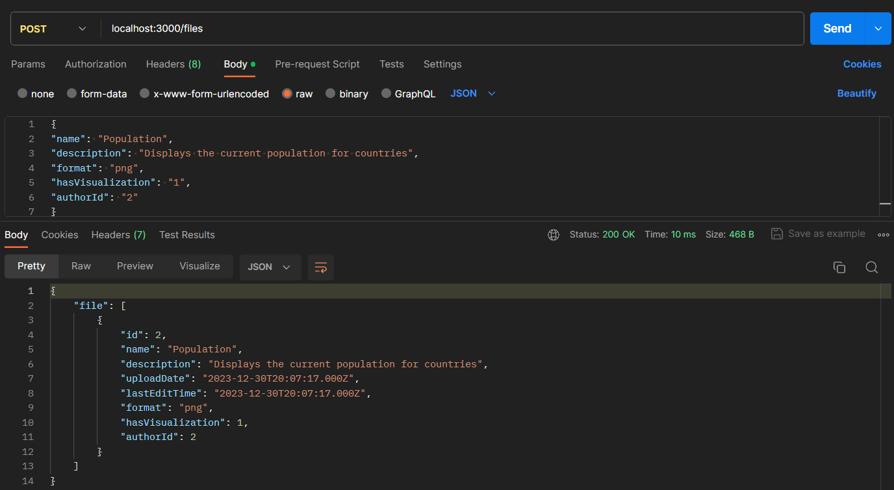
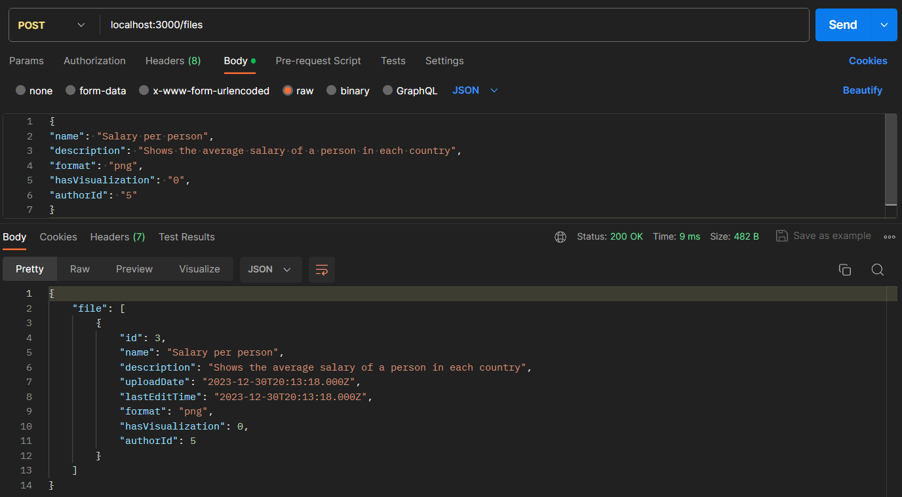
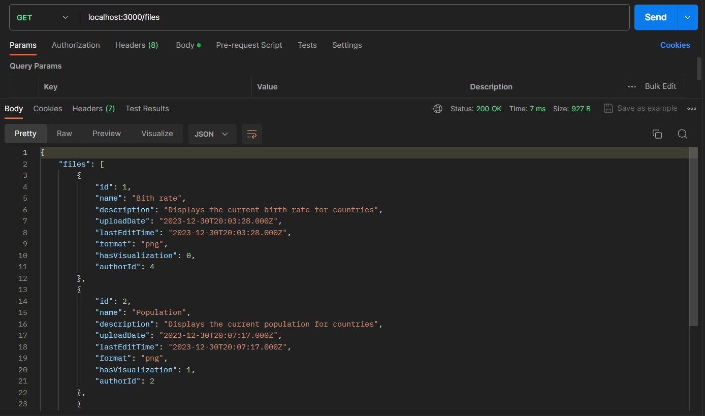
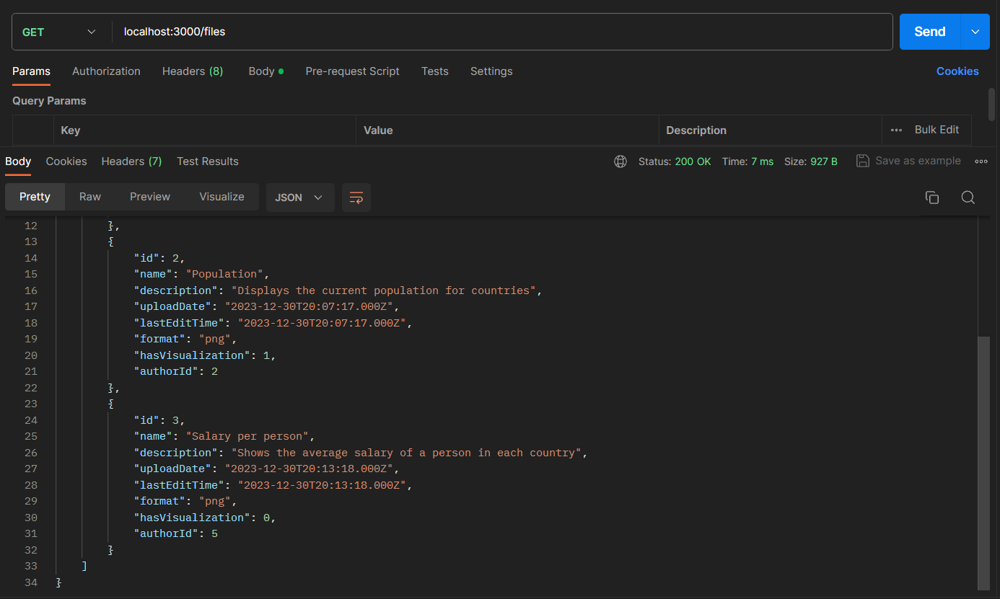
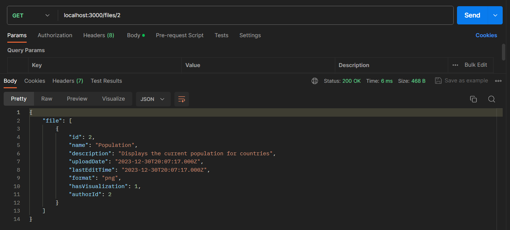
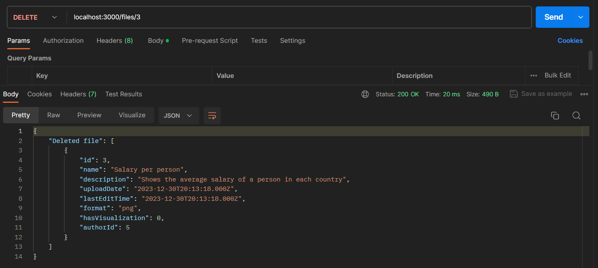
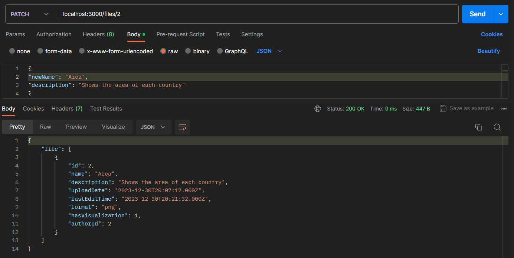
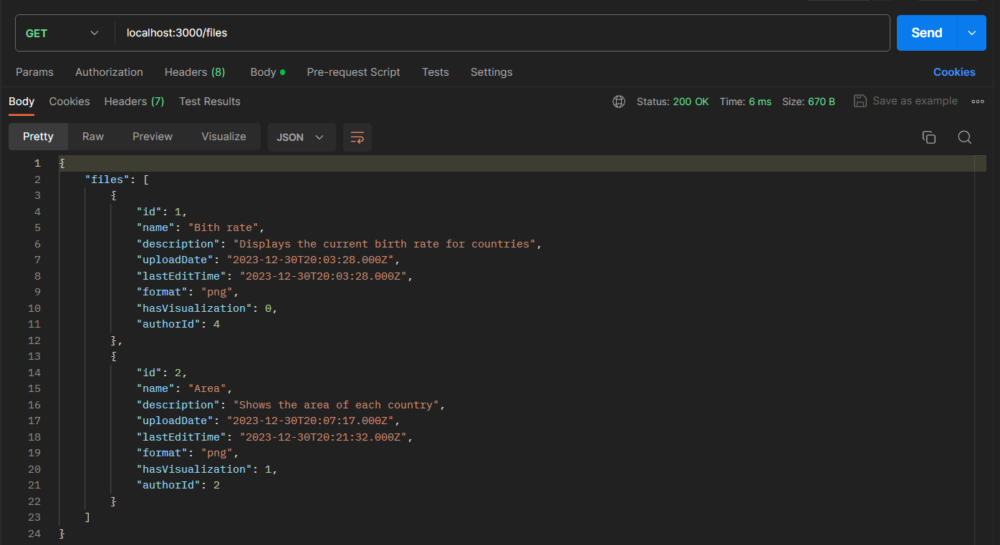

# Тестування працездатності системи

## Додавання нових файлів

## Отримання всіх наявних файлів

## Отримання файлу по ID

## Видалення файлу по ID

## Часткове оновлення інформації про файл

## Кінцеве отримання всіх наявних файлів

